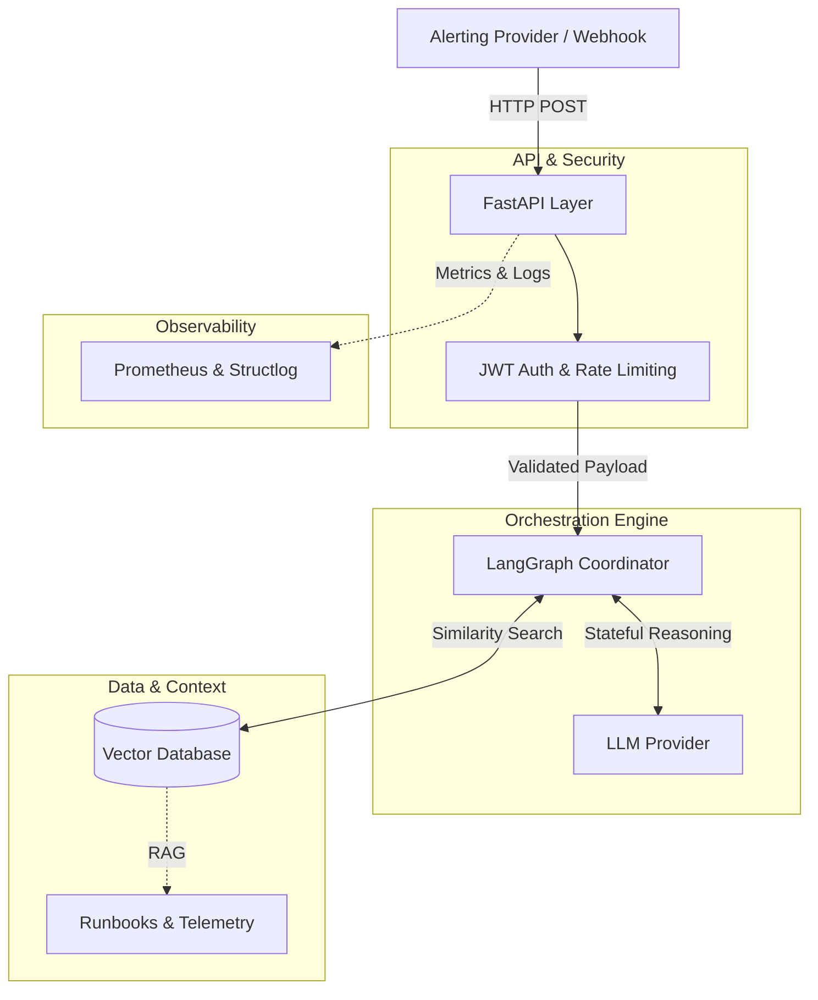

<div align="center">
  
  <h1>SeshOps</h1>
  <p><em>Incident Triage & Operational Orchestration</em></p>
  
  [](https://python.org)
  [](https://fastapi.tiangolo.com)
  [](https://python.langchain.com/docs/langgraph)
  [](LICENSE)
</div>

---

**SeshOps** is an intelligent backend system built to automatically triage, analyse, and remediate structural infrastructure incidents.

By leveraging **FastAPI** for high-performance network routing and **LangGraph** for deterministic LLM orchestration loops, SeshOps digests raw telemetry alerts (such as OOM events, database latency, or pod crashes), consults internal deployment runbooks via RAG (Retrieval-Augmented Generation), and produces actionable, human-readable diagnostic summaries for on-call engineers.

## Architecture

SeshOps is designed to be a resilient, modular backend engine. The core architecture consists of three primary layers:



1. **API Layer (FastAPI):**
   - Handles incoming webhooks from alerting providers (e.g., PagerDuty, Prometheus, Datadog).
   - Manages JWT-based authentication and rate limiting.
   - Provides fully asynchronous, non-blocking standard HTTP REST endpoints.

2. **Orchestration Layer (LangGraph):**
   - Coordinates the reasoning process. Instead of a single LLM call, it uses a stateful graph to break down the problem: extracting symptoms, defining the search parameters, and synthesising the final response.
   - Ensures deterministic execution paths, reducing hallucinations and improving reliability.

3. **Data & Context Layer:**
   - **Vector Database (pgvector / SQLite):** Stores and retrieves relevant runbooks and historical incident data based on semantic similarity.
   - **Observability:** Integrated with Prometheus for metrics and `structlog` for structured JSON logging to track model performance and API health.

## Features

- **Stateful Orchestration**: Multi-step reasoning loops using LangGraph to evaluate symptoms, accurately retrieve context, and propose mitigations.
- **High-Performance API**: Fully asynchronous FastAPI backend serving standard HTTP REST endpoints, ready for enterprise workloads.
- **Secure by Default**: JWT-based OAuth2 authentication, strict CORS/HSTS middleware, and declarative non-root Docker execution.
- **Local-First Development**: Built-in SQLite and `InMemoryVectorStore` fallback abstractions for rapid local testing without spinning up heavy GPU or Postgres containers.
- **Production Observability**: Pre-instrumented with Prometheus metrics and structured JSON logging (`structlog`).

## Quickstart

### Prerequisites

We recommend using [`uv`](https://github.com/astral-sh/uv) for dependency management, but standard `pip` is fully supported.

### 1. Installation

Clone the repository and install dependencies:

```bash
git clone https://github.com/xhu96/SeshOps.git
cd SeshOps

# If using uv (Recommended)
uv sync

# If using standard pip
python -m venv .venv
source .venv/bin/activate
pip install -r requirements.txt
```

### 2. Environment Setup

Copy the example environment file to bootstrap your local keys:

```bash
cp .env.example .env.development
```

Edit `.env.development` to include your OpenAI API key (required for the underlying LangGraph engine).

```env
APP_ENV=development
OPENAI_API_KEY=sk-your-key-here
JWT_SECRET_KEY=generate-a-secure-random-key
```

### 3. Run the Server

Bring up the local development server:

```bash
make dev
```

_(The server will boot and listen at `http://127.0.0.1:8000`)_

## Usage Example

SeshOps exposes a stateless REST API designed for immediate integration with webhook providers.

You can test the system end-to-end using the built-in demo simulation script:

```bash
uv run python scripts/e2e_demo.py
# Or: python scripts/e2e_demo.py
```

This script acts as an API integration client: it formally registers a test user, negotiates a JWT, and submits a simulated `Redis Cluster OOM` payload to the LangGraph `/api/v1/operations/triage` endpoint, returning the full orchestrator diagnostic summary.

## Testing

The codebase uses `pytest`. All integration endpoints and LangGraph validations are strictly mocked to ensure they run locally in milliseconds without consuming language model tokens.

```bash
make test
```

## Deployment

The repository is built natively for containerised deployment architectures (e.g., Kubernetes, ECS).

```bash
docker-compose up --build
```

This starts the full production stack, binding the structured JSON logger configurations, raising the Prometheus metrics dashboard, and utilising the `pgvector` engine for the vector stores.

## Contributing

Contributions are welcome. Please ensure that `make format` and `make lint` both pass locally before submitting a Pull Request.

## License

This project is licensed under the MIT License.
