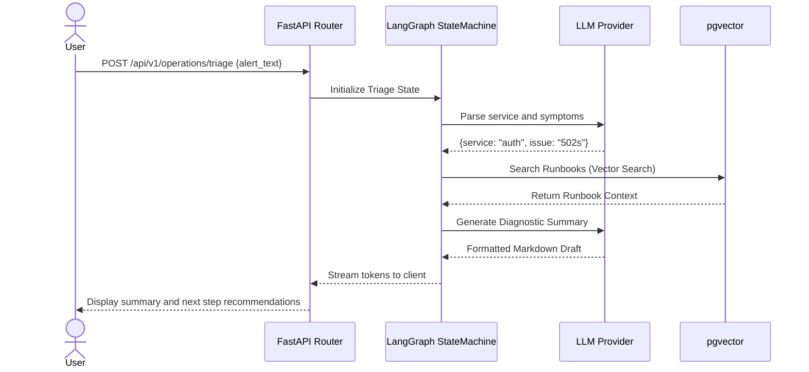

# Key Workflows

## 1. Incident Triage Workflow

The primary workflow triggered by an incoming alert payload or user description.

## 2. Ingestion & Retrieval (RAG)

Runbook markdown files are parsed into documents, chunked, embedded using `text-embedding-3-small` (or standard provider embedder), and upserted into `pgvector` collections.
