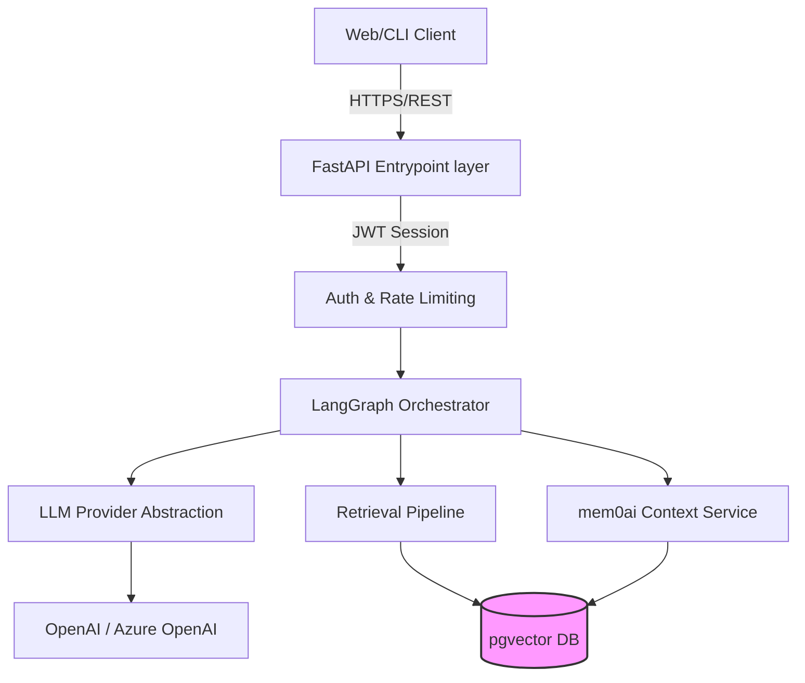

# System Overview

SeshOps is an internal enterprise tool designed for IT platform engineers to triage and diagnose system incidents securely. The architecture is heavily influenced by the `reference-v1` repository, adopting its core foundation of FastAPI, LangGraph, and PostgreSQL, while reshaping the product boundary from generic chat to strict workflow automation.

## Component Diagram

## Security Boundaries

1. **Network**: The Copilot sits inside the internal network, not exposed to the public internet.
2. **Access**: Strict JWT-based authentication inherited from v1.
3. **Data**: Proprietary IT data (runbooks, logs) is stored entirely in local PostgreSQL. Wait-listing third-party provider access to Azure or enterprise-grade OpenAI only.
4. **Execution**: The AI does not have autonomous write privileges; it generates diagnostic summaries and retrieval results for a human operators.
